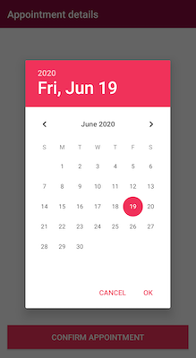
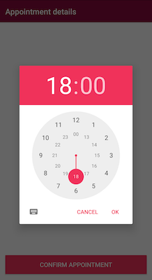

# DateTimePicker
[](https://bintray.com/mohamedabulgasem/maven/datetimepicker/_latestVersion)

  - [Introduction](#introduction)
  - [Requirements](#requirements)
  - [Getting Started](#getting-started)
    - [Declaring dependency](#declaring-dependency)
    - [Usage](#usage)
    - [Configuration](#configuration)
  - [License](#license)

## Introduction
An easy to use Date and Time picker that leverages the OS's Material
`DatePickerDialog` & `TimePickerDialog`.

  |  

## Requirements

- AndroidX Compatibility
- Minimum SDK Version 21

## Getting Started

### Declaring dependency

Add the dependency to your app or module `build.gradle` file:

```gradle
dependencies {
    implementation 'com.mohamedabulgasem:datetimepicker:0.2.0'
}
```

### Usage

Use DateTimePicker Builder to construct and show the picker:

```kotlin
// Pass activity reference to Builder and set your OnDateTimeSetListener
DateTimePicker.Builder(context)
    .onDateTimeSetListener { year, month, dayOfMonth, hourOfDay, minute ->
        // Use selected date and time values
    }
    .build()
    .show()
```

### Configuration

Additional configuration options:

```kotlin
private var dateTimePicker: DateTimePicker? = null

fun showDateTimePicker() {
    if (dateTimePicker == null) {
        dateTimePicker = DateTimePicker.Builder(this)
        
            // Set a listener to be invoked with selected date and time values.
            // Note: month is zero-based, Jan is 0; Dec is 11.
            .onDateTimeSetListener { year, month, dayOfMonth, hourOfDay, minute ->
                scheduleAppointment(year, month, dayOfMonth, hourOfDay, minute)
            }
            
            // Optionally run some code when the picker is shown/dismissed.
            .onShowListener { highlightAppointmentView(true) }
            .onDismissListener { highlightAppointmentView(false) }
            
            // Apply custom theme styling to the picker.
            // By default, the picker uses the consumer app theme values 
            // and mostly makes use of the colorAccent.
            .theme(R.style.DateTimePickerTheme)
            
            // Set initial picker date and time from a Calendar instance 
            // or by directly specifying the values.
            // By default, initialYear, initialMonth and initialDay are set 
            // to the current date; initialHour and initialMinute are set to zero.
            .initialValues(
                initialYear = 2021,
                initialMonth = 0,
                initialDay = 1,
                initialHour = 14,
                initialMinute = 30
            )
            
            // Indicate whether to use a 24 hour or 12 hour AM/PM view for the time picker.
            // By default, a 24 hour view is set.
            .is24HourView(false)
            
            // Optionally specify minimum/maximum date supported by the 
            // picker in milliseconds or by specifying date values.
            .minDate(System.currentTimeMillis())
            .maxDate(
                maxYear = 2022,
                maxMonth = 11,
                maxDay = 31
            )
 
            .build()
    }
    dateTimePicker?.show()
}
```

## License

    Copyright 2020 Mohamed Abulgasem

    Licensed under the Apache License, Version 2.0 (the "License");
    you may not use this file except in compliance with the License.
    You may obtain a copy of the License at

       http://www.apache.org/licenses/LICENSE-2.0

    Unless required by applicable law or agreed to in writing, software
    distributed under the License is distributed on an "AS IS" BASIS,
    WITHOUT WARRANTIES OR CONDITIONS OF ANY KIND, either express or implied.
    See the License for the specific language governing permissions and
    limitations under the License.
